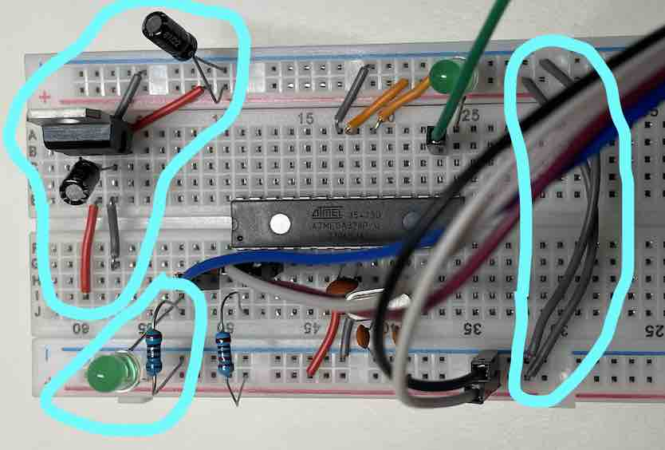
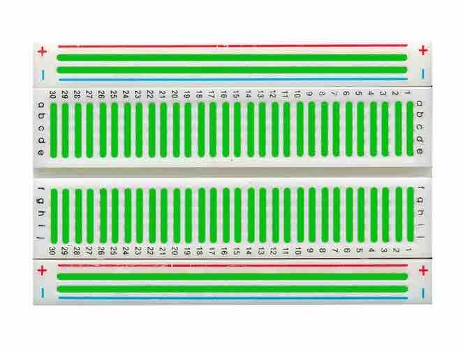
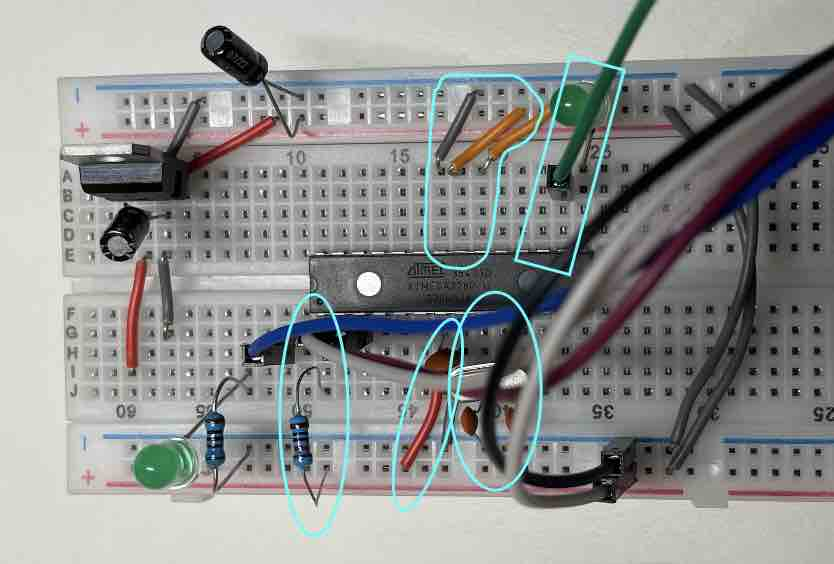
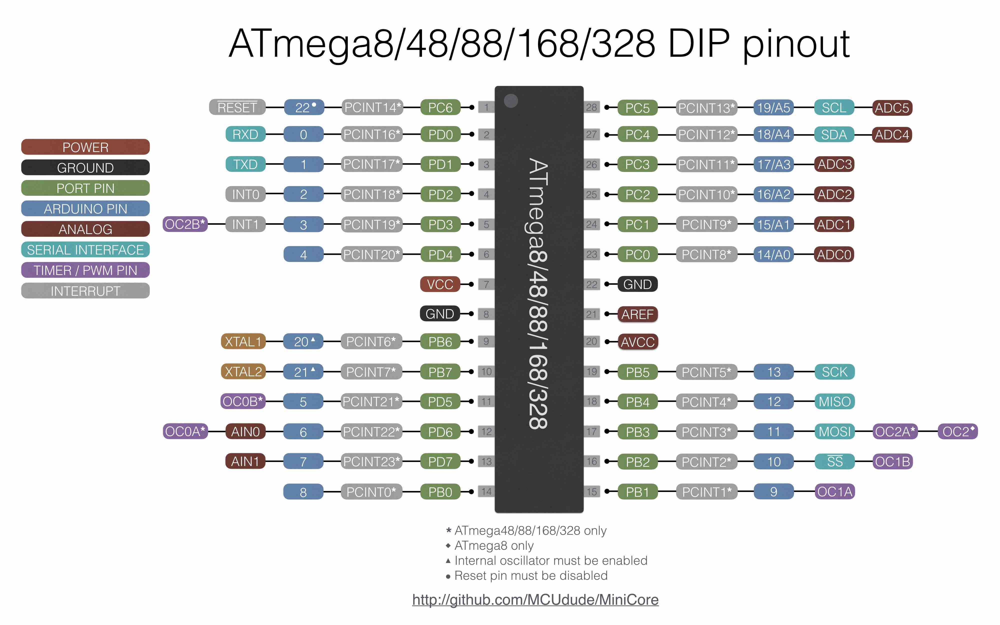
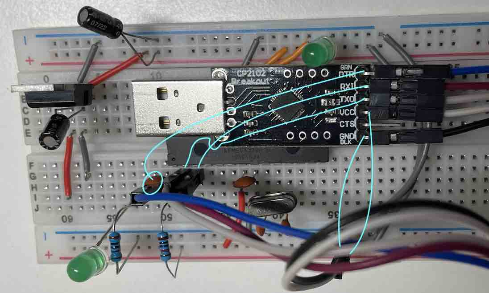
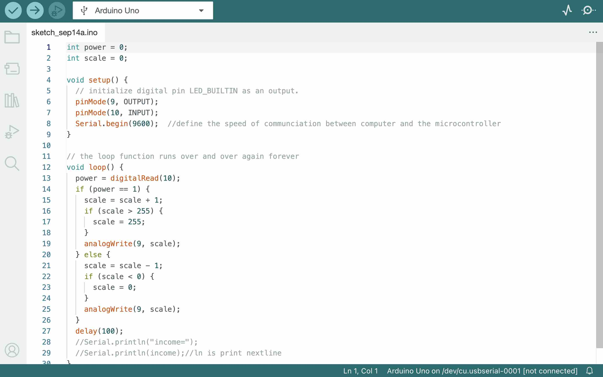

# Arduino on a Breadboard

## Description
This one-day challenge is to build an Arduino-compatible breadboard with an Atmel Atmega328 AVR microcontroller and a set of basic electronic components based on an [Arduino Tutorial](https://docs.arduino.cc/hacking/hardware/building-an-arduino-on-a-breadboard). Then, the board is connected to input and output devices, exchanging data with the computer through serial communication. This is conceived as an "ice-breaking" activity to familiarise with various electronic components and procedures and as a reference to design later circuits.

## Adding circuitry for a power supply/Power-Basics

* Add power and ground wires for where your voltage regulator will be. 
* Add power and ground wires at the bottom of your board connecting each rail. 
* Add the 7805 ***Voltage Regulator*** and the lines to power the board. 
* Add power OUT and ground wires that connect to the right and left rails of the breadboard.
* Add a 10μF ***Electrolytic Capacitor*** between the IN of the regulator and the ground and another one on the right rail between power and ground.
* Add an ***LED*** and a 220-ohm ***Resistor*** on the left side of your board across from the voltage regulator.
* The red and black wires to the left of the voltage regulator is where your power supply will be plugged in. The red wire is for the POWER and the black wire is for the GROUND. Be sure to only attach a power supply that is between 7-16V. Any lower and you won't get 5V out of your regulator. Any higher and your regulator may be damaged. A 9V battery, 9V DC power supply, or 12V DC power supply is suitable.

***1 Breadboard***

The breadboard has connected and unconnected lines inside in two directions. See these green lines in the picture below. Breadboard can be used for very fast prototyping, but since the joints are very loose, it is unstable for any device.

***2 Voltage Regulator/Transistor***

The voltage provided by power can be higher than the amount needed, for example, 5V, so we need a Voltage Regulator to lower the voltage. The Input from the external power supply goes input on the left leg (7~36V), the ground is in the middle, and the 5V output (this one is 7805 type, 05 means 5V output) is on the right (when facing the front of the regulator).

***3 Electrolytic Capacitor***

The current coming from the external power supply is always unstable and changes within a scope, so we need a capacitor to stabilise the current. The capacitor is a “Tank” that stores energy in the form of static electricity. Capacitors can take many forms as long as there are two conductive surfaces, called ELECTRODES, separated by an insulator. What we are using for the Voltage Regulator is two 10μF electrolytic capacitors with a silver strip on one side signifying the ground leg.

***4 LED diode*** 
 
Long leg and round side signify the positive/anode, short leg and flat side signify the negative/cathode. An LED attached to power like this is a great troubleshooting trick. You'll always know when your board is being powered as well as quickly know if your board is being shorted.

***5 Resistor***

Resistor reduces the current, following th OHM's Law: V=R*I

## ATmega Basics

* Connect a 10k ohm pullup resistor to +5V from the RESET pin in order to prevent the ***Chip*** from resetting itself during normal operation.
* Add a 16 MHz external ***Clock*** between pin 9 and 10, and add two 22 pF ***Ceramic Capacitors*** running to ground from each of those pins.
* Add a LED connected to pin 13 which is blinked with the blink_led program of the chip to check check whether the breadboard version Arduino works.

***6 Chip/Microcontroller/ATmega328***

Microcontroller is a simple, slow computer on a chip, the "Brain". The ATmega328 is an 8-bit microcontroller with the same processing power as the early generation home computers.

The ATmega pin number is better for hardware and the Arduino pin number is better for Arduino coding.

* Pin 7 - Vcc - Digital Supply Voltage. ATmega needs a stable voltage so a capacitor is added to pin7&8
* Pin 8 - GND
* Pin 22 - GND
* Pin 21 - AREF - Analog reference pin for ADC
* Pin 20 - AVcc - Suppply voltage for the ADC converter.
* Pin 1 - RESET, The RESET pin reboots the chip when pulled down to ground and it only needs voltage to work instead of current so an 10k ohm resisitor is connected to it.
* Serial Interface/Protocol: Pin 2 - RXD, Recieve Data, Pin 3 - TXD, Transmit Data, Pin 18 - MISO, Master in Slave out, Pin 19 MOSI, Master out Slave in, etc.
* Timer/PWM Pin: Pulse Width Modulation
* The power pin has the current of 2A, the data pin only has 0.2A

***7 Clock/Crystal Oscillator***

The crystal oscillator has a quartz inside oscillating by, for example, 16 MHz to tell the time for the chip. Both its legs need to connect to capacitors to ease the vibration the quartz made.

***Ceramic Capacitors***

The capacitor is a “Tank” that stores energy in the form of static electricity. Capacitors can take many forms as long as there are two conductive surfaces, called ELECTRODES, separated by an insulator. This 22 pf (picoFARAD) is a ceramic capacitor with a ceramic as the insulator and super thin metal layers at two sides.

## Arduino Ready/USB2Serial Board

* Add the ***USB to Serial Breakout Board*** to the Arduino breadboard circuit, to upload coding to the chip, transmitting data and recieving data by computer.
* GND ->GND
* CTS
* VCC ->VCC
* TXD ->RXD
* RXI ->TXD
* DTR -> 0.1μF CCapacitor -> RESET, because the USB tansmit data faster than ATmega so need a capacitor to balance.

## Arduino Coding

