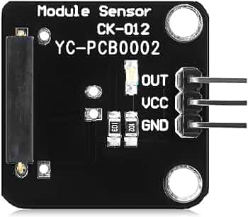

# Input Devices Try-Out

## Description
Experience data collection with digital and analog input devices. 

Pick one sensor from a collection and try it out with the prototyping breadboard. Connect the sensor to the suitable pin-headers and test it with a program. Read the sensor’s data using the Serial Monitor. 

Repeat the exercise with at least two digital and two analog sensors. Understand how the sensor works and how data is collected and used.

## Documentation
Document the four sensors and the Arduino codes (attention: Github uses Markdown language, if you paste Arduino code here, it will be rendered by Markdown, so plz find the way to show your Arduino codes).

**Reed Switch Sensor 震动开关模块**

Reed Switch is a digital sensor. I think it can tell whether it is horizontal or vertical, very like a key that rotate 90 degree

Here is a short pack of codings, using Reed Switch to control an LED:
<pre>
int state = 0;

void setup() {
pinMode(13, INPUT);
pinMode(12, OUTPUT);
Serial.begin(9600); //speed of the communication between my computer and ATmega
}

void loop() {
state = digitalRead(13);
Serial.println(state);
if (state==1){
  digitalWrite(12, HIGH);
}
else{
  digitalWrite(12, LOW);
}
}<pre>
